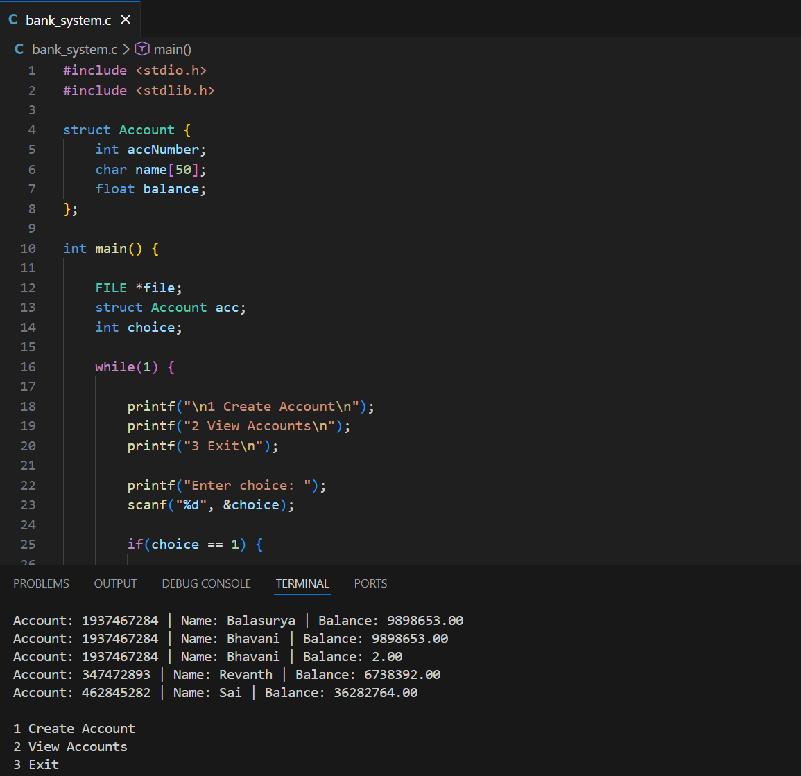

# Bank Management System (C)

A simple console-based Bank Management System written in C that allows users to create and view bank accounts.
The program stores account details using file handling so records persist even after the program is closed.

## Features

* Create new bank account
* Store account details in a file
* View all stored accounts
* Menu-driven interface

## Technologies Used

* C Programming Language
* Structures (`struct`)
* File Handling
* Loops and Conditional Statements

## Project Structure

bank_system.c
accounts.txt (created automatically when accounts are added)
README.md

## How to Run

Compile the program:

gcc bank_system.c -o bank_system

Run the program:

.\bank_system

## Example Output

1 Create Account
2 View Accounts
3 Exit

Enter choice: 1

Enter account number: 101
Enter name: Surya
Enter balance: 5000

Account created successfully!

## Concepts Demonstrated

* Structures in C
* File handling (`fopen`, `fprintf`, `fscanf`)
* Menu-driven programs
* Data persistence using files

## Author

Surya
